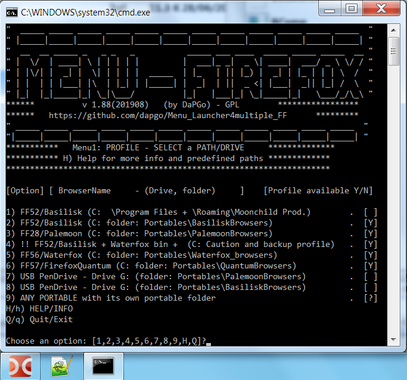
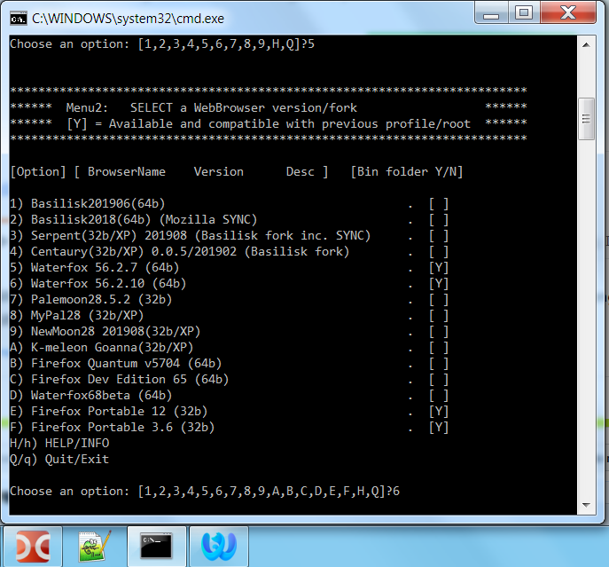

# Menu_Launcher4multiple_FF
A Menu launcher for all your FireFox browsers, allowing to share a common profile folder among different Firefox webbrowser (Basilisk, FF56, Waterfox, Basilisk forks) or (Palemoon, FF27, PM forks)

(Below screenshots are outdated, at the moment Menu is a bit better and nicer)

 
 
 
This Menu solution enables you to:
- have centralized menu to open all your webbrowsers
- run a different browser when a web page is not loading/ working properly
- use Firefox sync on Basilisk (using a 2018 version)
- test a new version of a webbrowser without replacing your "stable" version
- run a win32 fork in your older computer with WinXP but keeping your current profile

Real and useful scenarios:
- Do a FF sync with Basilisk2018 but keep as your main browser an updated Basilisk2019(Palemoon Sync)
- Run Waterfox on a webpage which is not loading properly with Basilisk.
- Run Serpent/Centaury (Basilisk forks) on your WindowsXP 32bits or ReactOS but keep as your main browser an updated Basilisk2019
- Run MyPal (PM fork) on your WindowsXP 32bits or ReactOS but keep as your main browser an updated Palemoon

