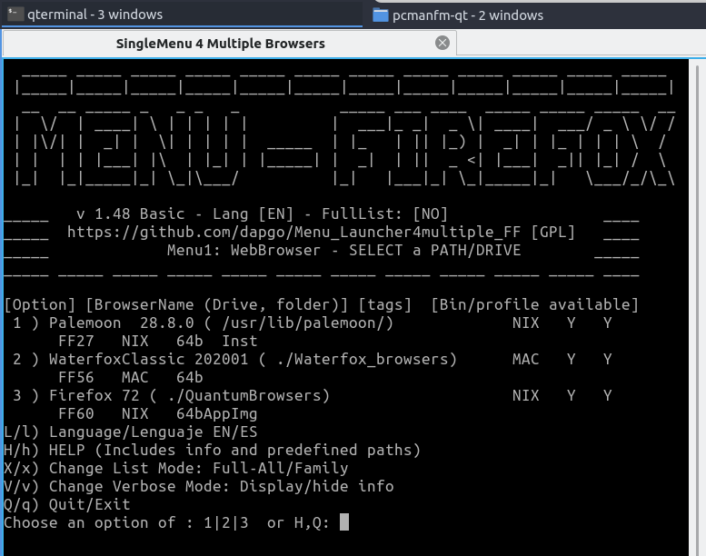
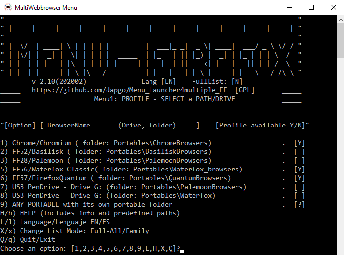

# Menu_Launcher4multiple_FF
It is a Menu to launch web-browsers and compatible with 2 type of Operating System (Windows and Unix/Mac) without installation.
Besides not requiring installation, the Menu is fully portable and it help also to make all your browsers portable. 

[DOWNLOAD FROM RELEASES SECTION](https://github.com/dapgo/Menu4multiple_Webrowsers/releases)

Other feature of this Menu is to allow the sharing of a common profile folder among different compatible Firefox webbrowser (Basilisk, FF56, Waterfox, Basilisk forks) or (Palemoon, FF27, PM forks). So, it is great help to allow the testing of a different webbrowser but using the same configuration than on you daily browsers.

(Below screenshots can be outdated, at the moment Menu is a bit better and nicer. Windows batch and BashPosix Linux/MacOSx are not completely aligend, so there are some differences)

Screenshot: Menu for Linux/macOS
 
 
Screenshot: Menu for Windows OS

 
 
 
 
This Menu solution enables you to:
- have centralized menu to open all your webbrowsers
- run a different browser when a web page is not loading/ working properly
- use Firefox sync on Basilisk (using a 2018 version)
- test a new version of a webbrowser without replacing your "stable" version
- run a win32 fork in your older computer with WinXP but keeping your current profile
- manage configuration through a config file and without need of programming skills (only Mac/Linux)

Real and useful scenarios:
- Do a FF sync with Basilisk2018 but keep as your main browser an updated Basilisk2019(Palemoon Sync)
- Run Waterfox on a webpage which is not loading properly with Basilisk.
- Run Serpent/Centaury (Basilisk forks) on your WindowsXP 32bits or ReactOS but keep as your main browser an updated Basilisk2019
- Run MyPal (PM fork) on your WindowsXP 32bits or ReactOS but keep as your main browser an updated Palemoon

