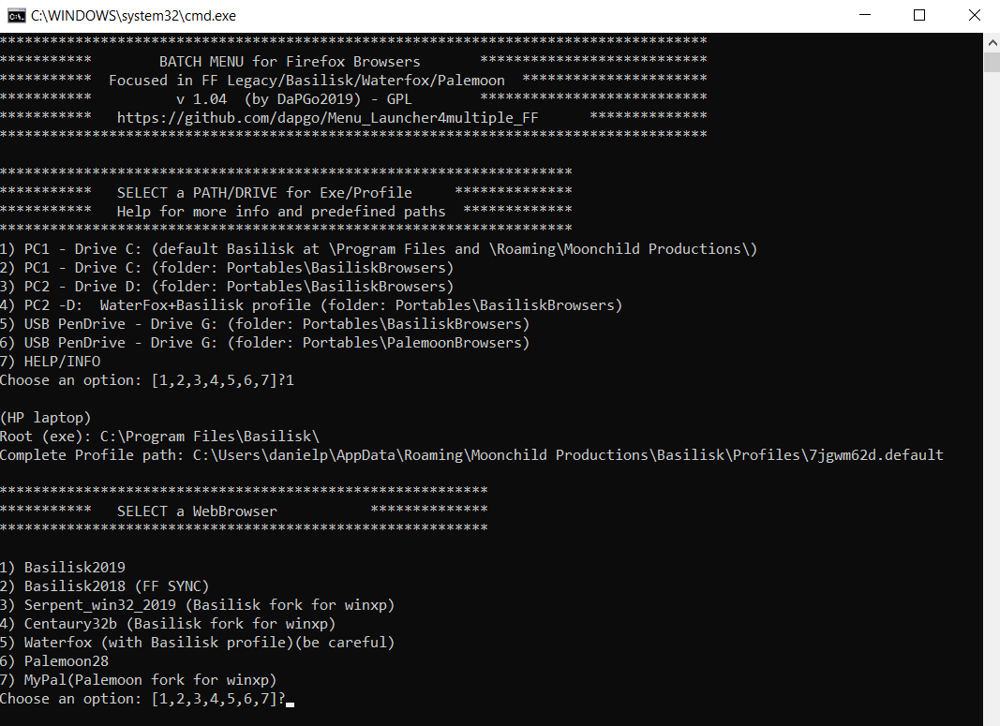

# Menu_Launcher4multiple_FF
A Menu launcher for all your FireFox browsers, allowing to share a common profile folder among different Firefox webbrowser (Basilisk, FF,Waterfox, etc..)

 

This Menu solution enables you to:
- run a different browser when a web page is not loading/ working properly
- use Firefox sync on an older Basilisk version
- test a new version of your favorite browser without replacing your "stable" version
- run a win32 fork in your older computer with WinXP but keeping your current profile

Real and useful scenarios:
- Do a FF sync with Basilisk2018 but keep as your main browser an updated Basilisk2019(Palemoon Sync)
- Run Waterfox on a webpage which is not loading properly with Basilisk.
- Run Serpent/Centaury on your WindowsXP 32bits or ReactOS but keep as your main browser an updated Basilisk2019
- Run MyPal on your WindowsXP 32bits or ReactOS but keep as your main browser an updated Palemoon
